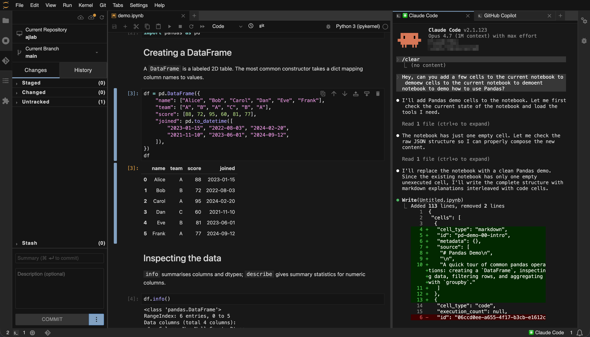

# ajlab

Agent-ready JupyterLab.



`ajlab` is a small meta-package that installs JupyterLab plus a few extensions
useful for agent workflows, and ships some defaults under `etc/jupyter/labconfig`.

## What's included

Minimum versions (see [`pyproject.toml`](./pyproject.toml)):

- `jupyterlab >=4.6.0a5`
- `jupyter-docprovider >=2.4.0a0` and `jupyter-server-ydoc >=2.4.0a0`
- `jupyter-server-mcp`
- `jupyterlab-commands-toolkit`

## Default settings

- Hidden files shown in the file browser.

## Install

```bash
pip install ajlab
```

## Run

Once installed, start JupyterLab with:

```bash
jupyter lab
```

## Configure agents

Agent connectivity is provided by [`jupyter-server-mcp`][mcp], which exposes an
MCP endpoint (default `http://localhost:3001/mcp`) that any MCP client can
connect to.

For example, to wire it up to Claude Code:

```bash
claude mcp add --transport http jupyter-mcp http://localhost:3001/mcp
```

See the [`jupyter-server-mcp` README][mcp] for tool registration via
`jupyter_config.py` and snippets for other MCP clients.

[mcp]: https://github.com/jupyter-ai-contrib/jupyter-server-mcp

## License

BSD-3-Clause
